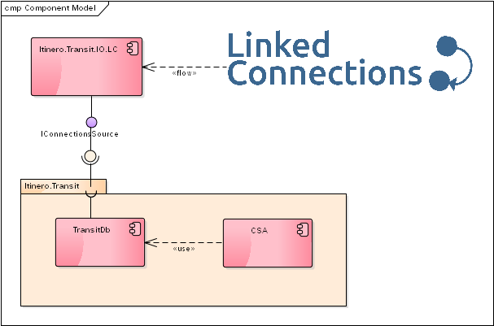

# itinero-transit

[/statusIcon)](https://build.anyways.eu/viewType.html?buildTypeId=anyways_Openplannerteam_ItineroTransit)  

This is a C# implementation of a client consuming [Linked Connections(LC)](https://linkedconnections.org/) to plan transit routes. This is going to replace the currently unfinished [transit module](https://github.com/itinero/transit) in [tinero](http://www.itinero.tech/).

# Documentation

To use the library and get a feel for the algorithm , please see our [documentation repo](https://github.com/itinero/docs/blob/feature/transit/docs/transit/index.md)
If you want to setup a http-server to perform routing, have a look [here](https://github.com/openplannerteam/itinero-transit/)

# Project overview

The source directory contains three sub-projects:

1) Itinero-Transit contains the algorithms, which use transitDbs to perform routing and necessary data structures and classes.
2) Itinero.Transit.IO.LC contains all code to create a transitDB from a LinkedConnection-source
3) Itinero.Transit.IO.OSM contains all code to create a transitDB based on relations which adhere to the PTv2-scheme and contain a class plan walks between stops using OSM.

## TransitDb

A TransitDb is a data structure which contains all stops, connections and trips. It can be build using LC, OSM or -if needed- by other sources.
By default, Itinero-Transit prefetches all the data and only does routeplanning afterwards.

The TransitDb is:
- A cache for connections    
- A highly optimized data structure.   
- A data structure that can be serialized to disk and accessed via memory-mapping.   
- A data structure that can be updated while routeplanning is happening.

It contains stops, connections and trips. The stops can be retrieved, updated or deleted by their IDs and queried by their geographical location. The connections can be enumerated either by their departure or arrival time and can be retrieved, updated or deleted by their ID.

A high-level overview of how these things tie together:

